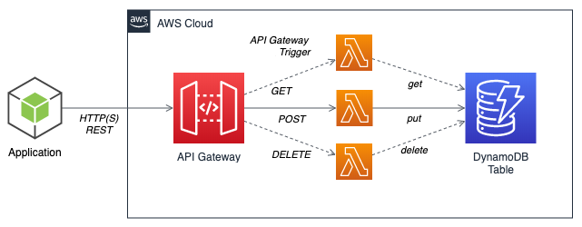

# Log User API Endpoint

This API is responsible for receiving POST API executions through an API Gateway, having a Lambda function as backend, which persists the data in a Dynamo DB. 


 
Image used only for reference. On this lab, only a Lambda function with POST verb is being implemented.

## Log User API Data

We will be receiving and processing User Log entries in a manner this data can be consolidated and later processed by another APIs.
## API Data Payload

This API has as mandatory input fields 'id(int)' and 'name(str)'. 
```
  "queryStringParameters": {
    "id": 1,
    "name": "Marcio Matos"
  },
```
## DynamoDB Data Store

The backend Lambda API validate and process the message and then stores it in a DynamoDB table called LogUser. An UID is generated, along the ID and name fields another column is created with name UpdateOn which tracks when the record was created or updated. 
### DynamoDB local development

Docker compose is used for creating Local Dynamo DB for development.  

The docker-compose file and scripts to help with the creation of tables can be found on folder [dynamodb-scripts](./dynamodb-scripts).

## API Response Message
### Successful response
```sh
{
    "uid": "USR73B5785AF1CF4B049FE5301026EE3BE5",
    "name": "Marcio Fernandes",
    "updatedOn": "2022-08-19T18:06:31.882266",
    "status": "Success",
    "message": "User log entry created successfully"
}
```
### Unsuccessful response
```sh
{
    "uid": "USR73B5785AF1CF4B049FE5301026EE3BE5",
    "name": "Marcio Fernandes",
    "updatedOn": "2022-08-19T18:16:31.882266",
    "status": "Failure",
    "message": "User log entry not created"
}
```

## AWS SAM Project folder

This is an AWS SAM standard project folder, which contains source code and supporting files for a serverless application that you can deploy with the SAM CLI. It includes the following files and folders.

- user_log - Code for the application's Lambda function.
- events - Invocation events that you can use to invoke the function.
- tests - Unit tests for the application code. 
- template.yaml - A template that defines the application's AWS resources.

The application uses several AWS resources, including Lambda function, an API Gateway API and a DynamoDB database. These resources are defined in the `template.yaml` file in this project. You can update the template to add AWS resources through the same deployment process that updates your application code.

## Tests

pytest Unit Tests are available in tests folder. It's also possible to run some local event tests or by using curl commands.

### Local Event tests

```
sam local invoke -e events/user_log.json

```
### Running curl or postman 
```sh
curl --location --request POST 'https://qy6nduxoek.execute-api.us-east-1.amazonaws.com/Prod/user_log/?id=1&name=Marcio%20Fernandes' \
--header 'Content-Type: application/json' \
--data-raw '{
  "resource": "/{proxy+}",
  "httpMethod": "POST",
  "isBase64Encoded": true,
  "queryStringParameters": {
    "id": 1,
    "name": "marcio"
  },
  "headers": {
    "Accept": "text/html,application/xhtml+xml,application/xml;q=0.9,image/webp,*/*;q=0.8",
    "Accept-Encoding": "gzip, deflate, sdch",
    "Accept-Language": "en-US,en;q=0.8",
    "Cache-Control": "max-age=0",
    "X-Forwarded-Port": "443",
    "X-Forwarded-Proto": "https"
  },
  "requestContext": {
    "stage": "prod",
    "resourcePath": "/{proxy+}",
    "httpMethod": "POST",
    "protocol": "HTTP/1.1"
  }
}
'
```
### Running locally as server 
```
sam local start-api
```
## Deployment 

### Using SAM cli

#### Build

```
sam build
```
#### Deploy 

```
sam deploy --guided # First time
sam deploy # Once config is place  
```

### CI CD Pipelines

Jenkins is used for the CI/CD as a Jenkinsfile is available on the root repository folder. 

aws-cli configuration is required before plug and run a Jenkins pipelines on this repository.

## Useful commands

### Invoking a Lambda function without an input event
```
sam local invoke "UserLogFunction"
```
###  Testing Input locally 
```
sam local invoke -e events/user_log.json
```
### Invoking a Lambda function using input from stdin
```
echo '{"id":"1","name": "marcio" }' | sam local invoke "HelloWorldFunction" --event - 
```
### Generate an Event payload
```
sam local generate-event apigateway aws-proxy > events/user_log.json
```
### Deleting a Stack
```
aws cloudformation delete-stack --stack-name loguserapi
```

## Todo

- Implement a process to periodically consolidate the table data within a period. 