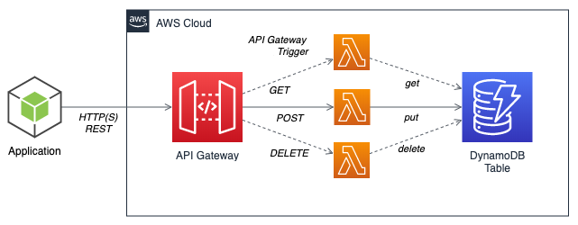

# Log User API Endpoint

This API is responsible for receiving POST API executions trought and API Gateway having a Lambda function as backend which persists the data in a Dynamo DB.  

## Project folder

This is AWS SAM standard project folder which contains source code and supporting files for a serverless application that you can deploy with the SAM CLI. It includes the following files and folders.

- log_user - Code for the application's Lambda function.
- events - Invocation events that you can use to invoke the function.
- tests - Unit tests for the application code. 
- template.yaml - A template that defines the application's AWS resources.

The application uses several AWS resources, including Lambda function, an API Gateway API and a DynamoDB database. These resources are defined in the `template.yaml` file in this project. You can update the template to add AWS resources through the same deployment process that updates your application code.
